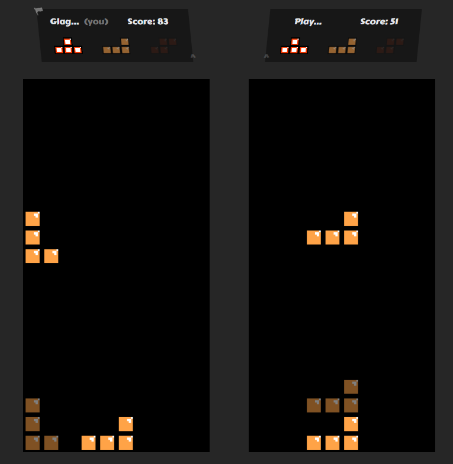
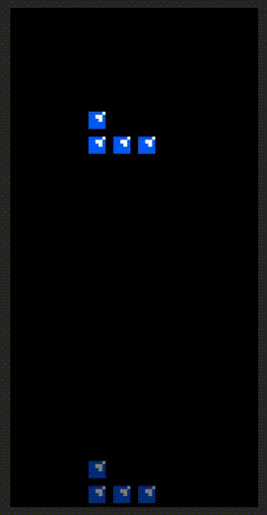

# red-tetris

**Red Tetris** is an online Tetris game where you play against an opponent, and the last player alive wins.

<p align="center">
    
</p>

## Features

* Organize games in rooms
* Matchmaking to quickly find a game
* Multiple themes to choose from and other visual options
* Game sounds

<p align="center">
    
</p>


## Developing

Everything can run in a single command after all dependencies have been installed (``yarn install``):

```bash
yarn run dev
```

If you wish to run the dev environment in docker instead, you can run:

```bash
docker compose --profile development up
```

The development server will be available on ``localhost:5173`` and has hot-reload enabled by default.

## Building

To create a production version you can first build the project:

```bash
yarn run build
```

And then start the production server on port ``3000`` with:

```bash
node server.js
```

You can also run the production image of the project with docker:

```bash
docker compose --profile production up
```
